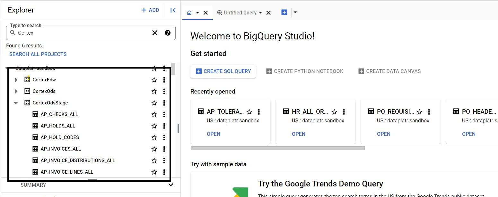
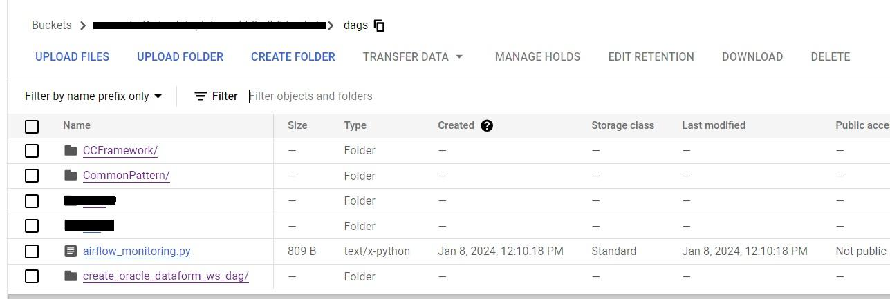
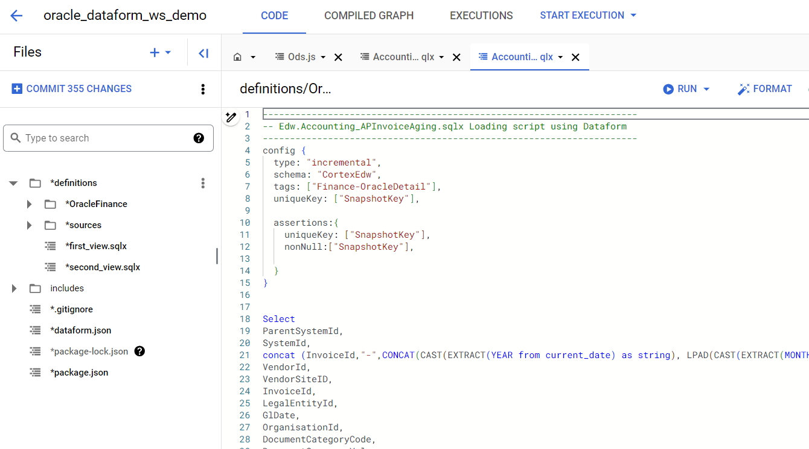
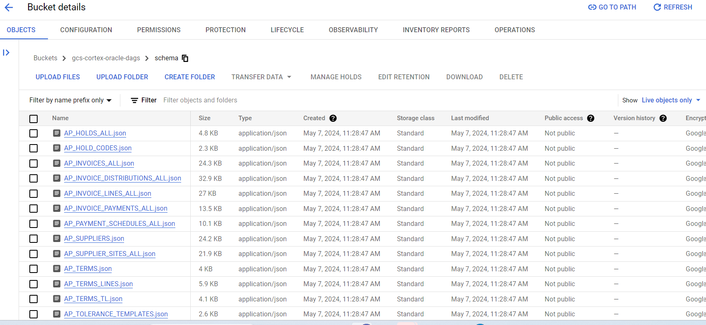

## **Cortex Framework for Oracle EBS**

## Quick setup for development instance

If you want to create a development instance with automatic generation of BigQuery datasets and permission granting, make sure your user account has enough permissions to run builds, assign permissions to the Cloud Build service account, 
 and create artifacts in Cloud Storage and BigQuery. Additionally, ensure to have the Cloud Composer environment (If you do not have an existing Cloud Composer instance, please create one by navigating to the repository using the following link: https://github.com/dataplatr/cloud-composer-oneclick) to run the dag code. Click the button below to proceed.

[](https://shell.cloud.google.com/cloudshell/?terminal=true&show=terminal&cloudshell_git_repo=https%3A%2F%2Fgithub.com%2Fdataplatr%2Fcortex-data-foundation-OracleEBS&cloudshell_tutorial=docs%2Ftutorial.md)

### Deployment configuration

| Parameter | Default Value | Description |
|---|---|---|
| projectId | - | Project where the source dataset is and the build will run. |
| deployORACLE | true | Execute the deployment for Oracle workload. |
| targetBucket | - | Bucket where dataform related files and logs will be generated. |
| location | “us” | Location where the BigQuery dataset and GCS buckets are. |
| composerDagBucket | - | Bucket where DAG related files will be generated. |
| df_ws_region | "us-central1" | Location where dataform Repository will be created. |
| ORACLE.datasets.OdsStage | - | This is where the raw data lands from ORACLE. |
| ORACLE.datasets.Ods | - | Processed data will land from the Stage. |
| ORACLE.datasets.Edw | - | Dataset that is accessible to end users for reporting, where views and user-facing tables are deployed. |
| df_repository_id | oracle_dataform | Name of the Repository that will be created. |
| df_workspace_id | oracle_dataform_workspace | Name of the dataform workspace to be created. |


**After deployment, tables will be generated within the designated datasets in BigQuery.**



**DAG-related files will be copied to the designated DAG bucket.**



**A new Dataform workspace will be set up, incorporating predefined Dataform codes.**



**Schema files will be copied to the designated GCS bucket.**




**Next Steps**

After the deployment is finished, proceed with the following steps:

1. Establish a connection between Google Cloud Storage (GCS) and your Oracle data source.
2. Create a GitHub repository and commit the predefined Dataform to the repository. Ensure the repository is properly configured and accessible for version control and collaborative development.
3. To set up Cloud Composer, use the config_variables.json file. First, open the file located in the Configurations folder of your project and specify essential parameters like project Id, location, and oracle connection Id etc. Ensure all values are accurate for your environment.

For complete instructions, please see the documentation : https://github.com/dataplatr/cortex-data-foundation-OracleEBS/blob/main/docs/Cloud_Composer_Framework_Documentation.pdf


## **Deployment for Production environments**

### **Clone the Data Foundation repository**

We recommend using the [Cloud Shell](https://shell.cloud.google.com/?fromcloudshell=true&show=ide%2Cterminal).

Note : These steps will require the gcloud sdk (already installed in Cloud Shell)**.**

```
git clone --recurse-submodules https://github.com/dataplatr/cortex-data-foundation-OracleEBS
```
Navigate into the folder

```
cd cortex-data-foundation-OracleEBS
```
**Deployment steps**

These are the steps for deployment:

1. Prerequisites

2. Establish project and dataset structure

3. Configure Cloud Platform Components

4. Configure deployment

5. Execute deployment

6. Test, customize, prepare for upgrade

**Prerequisites**

Understand the Framework

A successful deployment depends on a good understanding of:

- Your company's business rules and requirements

- Functional understanding of the workload

- Google Cloud fundamentals and products

Before continuing with this guide, make sure you are familiar with:

- Google Cloud Platform [fundamentals](https://www.cloudskillsboost.google/course_templates/60)

- How to navigate the [Cloud Console](https://cloud.google.com/cloud-console), [Cloud Shell](https://cloud.google.com/shell/docs/using-cloud-shell) and [Cloud Shell Editor](https://cloud.google.com/shell/docs/editor-overview)

- Fundamentals of [BigQuery](https://cloud.google.com/bigquery/docs/introduction)

- General navigation of [Cloud Build](https://cloud.google.com/build/docs/overview)

- Fundamentals of [Identity and Access Management](https://cloud.google.com/iam/docs/)

- Fundamentals of [Cloud Composer](https://cloud.google.com/composer/docs/concepts/overview) or [Apache Airflow](https://airflow.apache.org/docs/apache-airflow/stable/core-concepts/index.html)

**Establish project and dataset structure**

You will require at least one GCP project to host the BigQuery datasets and execute the deployment process.

This is where the deployment process will trigger Cloud Build runs. Workload should have the Stage, Ods and Reporting dataset (Edw).


**Data Integration overview**

You will need to identify:

- The Google Cloud Project where the data is stored, which will be accessed by technical practitioners for data model consumption.

- The Raw BigQuery Dataset (Stage), where the source data is replicated.

- The Ods BigQuery Dataset, where the latest available records from the CDC processing of data land.

- The BigQuery reporting dataset (Edw).

## **Configure Google Cloud Platform components**

### **Enable Required Components**

The following Google Cloud components are required:

- Google Cloud Project

- BigQuery instance and datasets

- Service Account

- Cloud Storage Buckets

- Cloud Composer

**Grant permissions to the executing user**

If an individual is executing the deployment with their own account, they will need, at minimum, the following permissions in the project where Cloud Build will be triggered:

- Service Usage Consumer

- Storage Object Viewer for the Cloud Build default bucket or bucket for logs

- Object Writer to the output buckets

- Cloud Build Editor

- Project Viewer or Storage Object Viewer

**Create a Storage bucket for storing DAG related files**

A storage bucket will be required to store DAG scripts and generated  logs during deployment. These scripts will have to be manually moved into a Cloud Composer or Apache Airflow instance after deployment.

Navigate to Cloud Storage and create a bucket in the same region as your BigQuery datasets.

Alternatively, you can use the following command to create a bucket from the Cloud Shell:

```
gsutil mb -l <REGION/MULTI-REGION> gs://<BUCKET NAME>
```
## **Configure Deployment**

The behavior of the deployment is controlled by the configuration file** config.json** .

The file contains global configuration and configuration specific to workload.


Open the file in** config/config.json. **From the Cloud Shell:

```
edit config/config.json
```
## **Execute Deployment**

This step requires config.json to be configured as described in the section Configure Deployment.

Run the Build command with the target log bucket.

```
bash deploy.sh
```
You can follow the main Build process from the first link of logs:


Alternatively, if you have enough permissions, you can see the progress from [Cloud Build](https://console.cloud.google.com/cloud-build/).


